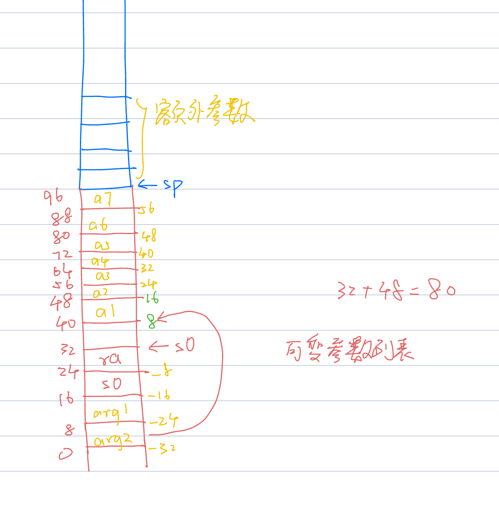
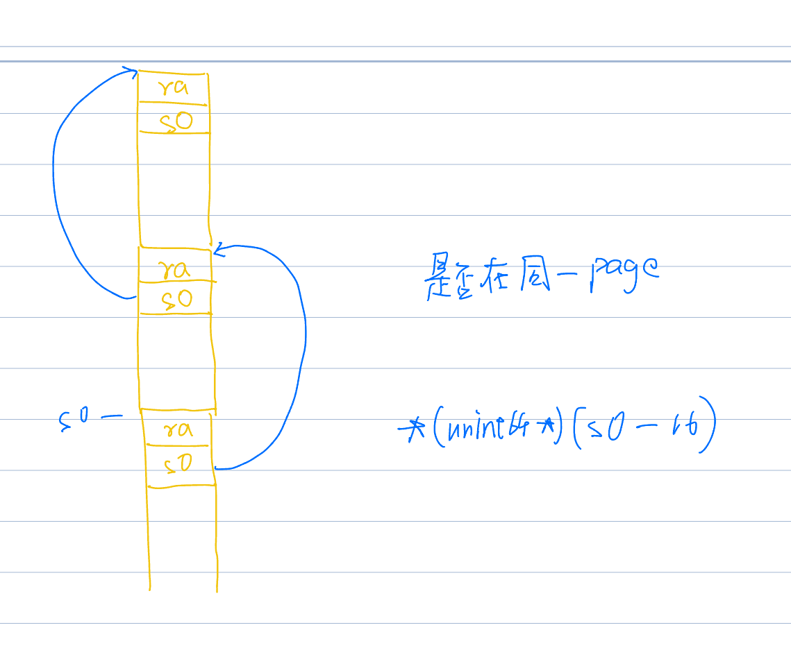
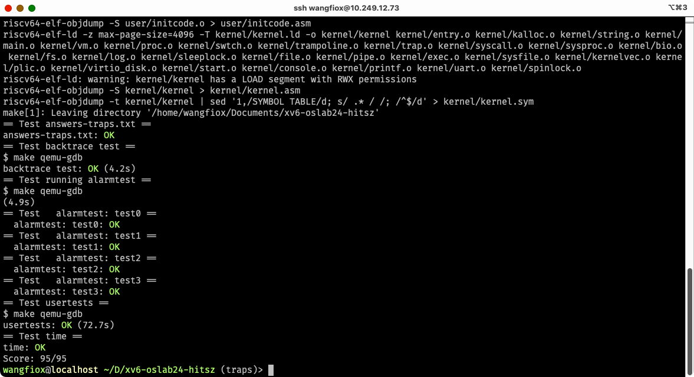

# traps

## 回答问题

### 1. Which registers contain arguments to functions? For example, which register holds 13 in main's call to printf?

1. a0, a1, a2, a3, a4, a5, a6, a7 用于传参, 额外参数会放 caller 的栈顶
2. a2

### 2. Where is the call to function f in the assembly code for main? Where is the call to g? (Hint: the compiler may inline functions.)

`26:   45b1                    li      a1,12` in user/call.asm is the call to function f, 这里 f 直接被计算出来了, 优化了。
同时, 这一行也是调用了 g

### 3. At what address is the function printf located?

`0000000000000640 <printf>:`

### 4. What value is in the register ra just after the jalr to printf in main?

`0x38`

### 5. big-endian, little-endian

-   题目:

Run the following code.

```c
unsigned int i = 0x00646c72;
printf("H%x Wo%s", 57616, (char \*) &i);
```

What is the output? Here's an ASCII table that maps bytes to characters.
The output depends on that fact that the RISC-V is little-endian. If the RISC-V were instead
big-endian what would you set i to in order to yield the same output? Would you need to change 57616 to a different value?
Here's a description of little- and big-endian and a more whimsical description.

-   回答:

1. rld\x00
2. \x00 (啥也不输出)
3. no need

### 6. va_list

-   题目:

In the following code, what is going to be printed after 'y='? (note: the answer is not a specific value.) Why does this happen?

```c
printf("x=%d y=%d", 3);
```

-   分析:

可变长参数的栈的布局如下



-   回答:

y=%d, 这实际上访问的是: 进入 printf 的时候的 a2, 这几乎是一个随机值了

## Backtrace

这个 backtrace, 实际上就是一个: 栈展开



`-16(s0)` 这个位置, 就是上一个栈帧的 s0, 于是乎, 这可以构成一个单向链表.
结束条件是: 上一个栈帧的 s0, 与当前的 s0 不在同一个 page 中: `    if (PGROUNDDOWN(fp) != PGROUNDDOWN(cur)) break;`

代码如下

```c
void backtrace(void) {
  uint64 cur = r_fp();  // linked list

  while (1) {
    uint64 ra = *(uint64 *)(cur - 8);
    printf("%p\n", ra);
    uint64 fp = *(uint64 *)(cur - 16);
    if (PGROUNDDOWN(fp) != PGROUNDDOWN(cur)) break;
    cur = fp;
  }
  return;
}
```

## Alarm

### 内容分析

添加系统调用: sigalarm, sigreturn.
`int sigalarm(int ticks, void (*handler)(void))` 用于注册: 经过了 ticks 时间后, 执行流从 main(假设是在用户程序的 main 函数中被 alarm 的)跳入 handler 函数中。`int sigreturn()` 则是从: handler 函数中, 返回到 main 的被 alarm 的上下文中, 这需要恢复到发生 alarm 前的状态

### 设计方法

在 pcb 中添加: alarm 前的上下文, 以及 alarm 的 ticks

```c
struct proc {
  // ...
  // for alarm
  bool alarm_active;        // alarm is active
  int alarm_ticks;          // remaining ticks
  int alarm_interval;       // interval in ticks
  uint64 alarm_handler_va;  // handler virtual address (user space)
  struct trapframe *alarm_before;
};
```

在 allocproc 中添加对这些字段的初始化

```c
static struct proc * allocproc(void) {
  // ...
  p->alarm_handler_va = 0;
  p->alarm_ticks = 0;
  p->alarm_interval = 0;
  if ((p->alarm_before = (struct trapframe *)kalloc()) == 0) {
    freeproc(p);
    release(&p->lock);
    return 0;
  }
  // ...
}
```

在 freeproc 中释放资源

```c
static void freeproc(struct proc * p) {
  // ...
  if (p->alarm_before) kfree((void *)p->alarm_before);
  // ...
}
```

增加系统调用 sigalarm, 用于设置 ticks, handler

```c
int sigalarm(int ticks, uint64 handler) {
  struct proc *p = myproc();
  if (ticks == 0 && handler == 0) {
    p->alarm_ticks = 0;
    p->alarm_interval = 0;
    p->alarm_handler_va = 0;
  } else {
    p->alarm_ticks = 0;
    p->alarm_interval = ticks;
    p->alarm_handler_va = handler;
  }
  return 0;
}

uint64 sys_sigalarm(void) {
  int ticks;
  uint64 handler;

  argint(0, &ticks);
  argaddr(1, &handler);
  return sigalarm(ticks, handler);
}
```

每发生一次时钟中断, 则会跳入 usertrap 函数中, 增加 alarm_ticks;
如果时间到了预设值, 则保存上下文, 并且设置新的上下文

```c
void usertrap(void) {
  // ...
  if (which_dev == 2) {
    p->alarm_ticks++;
    if (p->alarm_ticks == p->alarm_interval && p->alarm_interval > 0 && p->alarm_active == false) {
      // context
      *p->alarm_before = *p->trapframe;
      p->trapframe->epc = p->alarm_handler_va;
      // reset
      p->alarm_ticks = 0;
      // active
      p->alarm_active = true;
    } else {
      yield();
    }
  }
  // ...
}
```

增加系统调用 sigreturn, 用于返回

```c
// kernel/sysproc.c
uint64 sys_sigreturn(void) { return sigreturn(); }

// kernel/proc.c
int sigreturn(void) {
  struct proc *p = myproc();
  *p->trapframe = *p->alarm_before;
  p->alarm_ticks = 0;
  p->alarm_active = false;
  return p->trapframe->a0;
}
```

## make grade


