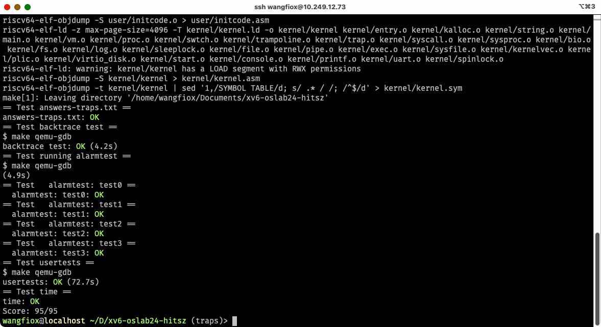

# mmap

## 内容分析

mit's xv6 实验指导书中有提示

1. 添加系统调用
2. mmap 在页表中, 对应的 page 采用 lazy allocate
3. pcb 中添加 vma(virtual memory area) 数据结构
4. 实现 mmap, munmap
5. 注意 fork, exit 的处理, 资源回收等

### 设计

主要是添加一个数据结构, 这个数据结构是参考的 csapp

```c
typedef struct VIRTUAL_MEMORY_AREA_STRUCT {
  uint64 vma_start;
  uint64 vma_end;
  uint64 vma_origin;  // 用于 munmap 后计算 offset 的
  union {
    uint64 _mode_value;
    struct {
      uint64 read : 1;
      uint64 write : 1;
      uint64 execute : 1;  // 这个对于 mmap 来说是无效的
      uint64 private : 1;
      uint64 valid : 1;  // 是否有效
    };
  };
  struct file *file;
} vm_area_t;
```

其实按道理来说, 对于 .stack, .text, .data 来说, 实际上应该都加入到 vma 中.
但是对于这个实验来说, 实际上那个只用记录 mmap 的 vma 就行了.

### 代码实现: mmap, munmap

添加系统调用

```c
// kernel/vm.c
uint64 sys_mmap(void) {
  uint64 addr, len, offset;
  int prot, flags, fd;

  argaddr(0, &addr);
  if (addr != 0) addr = 0;  // 😝
  argaddr(5, &offset);
  if (offset == 0) offset = 0;
  argaddr(1, &len);  // args
  argint(2, &prot);
  argint(3, &flags);
  argint(4, &fd);

  struct file *f;
  if (fd < 0 || fd >= NOFILE || (f = myproc()->ofile[fd]) == 0) return -1;

  return (uint64)mmap(len, prot, flags, f);
}

uint64 sys_munmap(void) {
  uint64 addr, len;
  argaddr(0, &addr);
  argaddr(1, &len);
  return munmap((void *)addr, len);
}
```

添加 mmap / munmap.

mmap 的设计思路: 如果当前进程没有分配 vma, 那么就分配一个页面作为 vma.
流程: 分配一个起始地址 (这个起始地址可以到 MAXVA, 因为我们 pagetable 只是记录的用户态的地址空间).
在 vma 中找到一个空白的 slot, 用于存放在这个 mmap. 然后我们在 pagetable 中写上相应的 mmap 记录.
需要注意资源回收.

当然, 中间需要注意 f 的引用计数, 防止系统中的打开文件表中, f 被占用, 导致不安全的情况.

```c
// kernel/vm.c
void *mmap(size_t len, int prot, int flags, struct file *f) {
  if (!f->readable && (prot & PROT_READ) && (flags & MAP_SHARED)) {
    printf("%s:%d\n", __FILE__, __LINE__);
    return (void *)-1;
  }

  if (!f->writable && (prot & PROT_WRITE) && (flags & MAP_SHARED)) {
    printf("%s:%d\n", __FILE__, __LINE__);
    return (void *)-1;
  }

  struct proc *p = myproc();
  if (p->vma == 0) {
    p->vma = (vm_area_t *)kalloc();
    if (p->vma == 0) {
      printf("%s:%d\n", __FILE__, __LINE__);
      return (void *)-1;
    }
    memset(p->vma, 0, PGSIZE);
  }

  // select a start address
  uint64 start_addr = VMA_BEGIN;
  for (int i = 0; i < VMA_LENGTH; i++) {
    if (p->vma[i].valid == 1) {
      if (start_addr < p->vma[i].vma_end) {
        start_addr = p->vma[i].vma_end;
      }
    }
  }
  start_addr = PGROUNDUP(start_addr);  // 向上找一个页
  if (!(VMA_BEGIN <= start_addr && start_addr < MAXVA)) {
    printf("%s:%d\n", __FILE__, __LINE__);
    return (void *)-1;
  }
  // find a free slot
  int i, found = 0;
  for (i = 0; i < VMA_LENGTH; i++) {
    if (p->vma[i].valid == 0) {
      p->vma[i].valid = 1;
      p->vma[i].read = !!(prot & PROT_READ);
      p->vma[i].write = !!(prot & PROT_WRITE);
      p->vma[i].execute = 0;
      p->vma[i].private = !!(flags & MAP_PRIVATE);
      p->vma[i].vma_start = start_addr;
      p->vma[i].vma_end = start_addr + len;
      p->vma[i].file = f;
      acquire(&ftable.lock);
      if (f->ref < 1) panic("%s:%d", __FILE__, __LINE__);
      f->ref++;
      release(&ftable.lock);
      found = 1;
      break;
    }
  }

  if (!found) return (void *)-1;

  p->vma[i].vma_origin = start_addr;

  uint64 last = start_addr;
  while (last < start_addr + len) {
    pte_t *pte = walk(p->pagetable, last, 1);  //
    if (pte == 0) {                            // reroll
      p->vma[i].vma_start = 0;
      p->vma[i].vma_end = 0;
      p->vma[i]._mode_value = 0;
      p->vma[i].file = 0;
      acquire(&ftable.lock);
      if (f->ref < 1) panic("%s:%d", __FILE__, __LINE__);
      f->ref--;
      release(&ftable.lock);
      printf("%s:%d\n", __FILE__, __LINE__);
      return (void *)-1;
    }
    uint64 pte_flags = PTE_U;  // 没有 PTE_V, 要引发 page fault
    if (prot & PROT_READ) pte_flags |= PTE_R;
    if (prot & PROT_WRITE) pte_flags |= PTE_W;
    *pte = pte_flags;
    last += PGSIZE;
  }

  return (void *)start_addr;
}
```

munmap 的流程: 找到对应的 vma, munmap 的时候, 需要应付: munmap 中间挖洞的情况.
找到 addr 对应的 vma, 修改其中的字段, 并删除 pagetable 中对应的记录.

```c
// kernel/vm.c
int munmap(void *addr, size_t len) {
  uint64 va = (uint64)addr;
  struct proc *p = myproc();

  int i, found = 0;
  for (i = 0; i < VMA_LENGTH; i++) {
    if (p->vma[i].vma_start <= va && va < p->vma[i].vma_end && p->vma[i].valid) {
      found = 1;
      break;
    }
  }

  if (found == 0) {  // not found
    printf("%s:%d\n", __FILE__, __LINE__);
    return -1;
  }

  if (p->vma[i].vma_end < va + len) {  // end out of range
    printf("%s:%d\n", __FILE__, __LINE__);
    return -1;
  }

  if (p->vma[i].vma_end != va + len && p->vma[i].vma_start != va) {  // 出现了中间挖洞的情况
    printf("%s:%d\n", __FILE__, __LINE__);
    return -1;
  }

  if (p->vma[i].vma_start != va) {  // 去尾
    p->vma[i].vma_end = va;
  } else {                                // 掐头
    if (p->vma[i].vma_end == va + len) {  // delete
      p->vma[i].vma_start = 0;
      p->vma[i].vma_end = 0;
      p->vma[i]._mode_value = 0;

      // free pages
      struct file *f = p->vma[i].file;
      uint64 va0 = PGROUNDDOWN(va);
      uint64 vaend1 = PGROUNDUP(va + len);
      if (!p->vma[i].private) {  // shared mmap
        f->off = va0 - p->vma[i].vma_origin;
        filewrite(f, va0, vaend1 - va0);
      }
      // file
      if (!f) {
        printf("%s:%d\n", __FILE__, __LINE__);
        return -1;
      }
      acquire(&ftable.lock);
      if (f->ref < 1) panic("%s:%d", __FILE__, __LINE__);
      f->ref--;
      release(&ftable.lock);
      p->vma[i].file = 0;
      uvmunmap_f(p->pagetable, va0, (vaend1 - va0) / PGSIZE);
    } else {
      p->vma[i].vma_start = va + len;

      // free pages
      uint64 va1 = PGROUNDUP(va);
      uint64 vaend0 = PGROUNDDOWN(va + len);
      if (!p->vma[i].private) {  // shared mmap
        struct file *f = p->vma[i].file;
        f->off = va1 - p->vma[i].vma_origin;
        filewrite(f, va1, vaend0 - va1);
      }
      uvmunmap_f(p->pagetable, va1, (vaend0 - va1) / PGSIZE);
    }
  }

  return 0;
}
```

### 代码实现: fork

```c
// kernel/proc.c
int fork(void) {
  // ...
  if (p->vma) {
    printf("%s:%d vma for child\n", __FILE__, __LINE__);
    np->vma = (vm_area_t *)kalloc();
    if (np->vma == 0) {
      freeproc(np);
      return -1;
    }
    memmove(np->vma, p->vma, PGSIZE);
    for (int i = 0; i < VMA_LENGTH; i++) {
      if (np->vma[i].valid) {
        acquire(&ftable.lock);  // ref ++
        if (np->vma[i].file->ref < 1) panic("%s:%d", __FILE__, __LINE__);
        np->vma[i].file->ref++;
        release(&ftable.lock);

        // copy pte from parent to child
        uint64 va0 = PGROUNDDOWN(np->vma[i].vma_start);
        for (; va0 < np->vma[i].vma_end; va0 += PGSIZE) {
          pte_t *copy_from = walk(p->pagetable, va0, 0);
          if (copy_from == 0) panic("%s:%d", __FILE__, __LINE__);
          if (!np->vma->private) {  // shared
            uint64 mem = (uint64)kalloc();
            if (mem == 0) panic("%s:%d", __FILE__, __LINE__);
            memset((void *)mem, 0, PGSIZE);
            begin_op();
            if (readi(np->vma[i].file->ip, 0, mem, va0 - np->vma[i].vma_origin, PGSIZE) < 0) {
              end_op();
              kfree((void *)mem);
              panic("%s:%d", __FILE__, __LINE__);
            } else {
              end_op();
              pte_t *copy_to = walk(np->pagetable, va0, 1);
              if (copy_to == 0) panic("%s:%d", __FILE__, __LINE__);
              *copy_to = PA2PTE(mem) | PTE_FLAGS(*copy_from) | PTE_V;
              printf("%s:%d fork shared\n", __FILE__, __LINE__);
            }
          } else {
            pte_t *copy_to = walk(np->pagetable, va0, 1);
            if (copy_to == 0) panic("%s:%d", __FILE__, __LINE__);
            *copy_to = PTE_FLAGS(*copy_from) & ~PTE_V;
          }
          // *copy_to = *copy_from;
          // extern void inc_ref(void *pa);
          // inc_ref((void *)PTE2PA(*copy_to));
        }
      }
    }
  }
  // ...
}
```

这个 fork 的实现实际上是有瑕疵的. 这里如果 readi 失败, 我就直接 panic 了,
并且祈祷不会发生极端情况下的测试用例: 因为这个资源的回收比较麻烦.

然后我这里, 对于 shared 的 vma, 其实是有问题的: 其他进程对 mmap 的内存发生了修改,
xv6 没有很好的机制可以及时的将修改的内容 flush 到对应的文件中, 并同步到其他相应的 mmap 对应的内存中.
所以我这里严格来说, 并不是 mmap.

我这里对于 shared 的 vma 来说, 子进程就直接从文件中装载就行了. 这可以已通过测试(

对于 private 的 vma 来说, 子进程采用懒分配的策略: 只在 pagetable 上写一条记录即可.

### 代码实现: usertrap

上面我提到了 private 的 vma 采用懒分配.

usertrap 对于 load page fault 的流程是: 查找是否有 va 对应的 vma, 如果没有 segmentation fault.
如果有, 则分配 page, 并 readi 到 page 中 , 然后挂载 pagetable 中. 以上过程, 注意资源回收

```c
void usertrap(void) {
  // ...
  } else if (r_scause() == 0xd) /* load page fault, not access fault */ {
    if (!p->vma) {
      printf("%s:%d: unexpected scause %p pid=%d\n", __FILE__, __LINE__, r_scause(), p->pid);
      printf("            sepc=%p stval=%p\n", r_sepc(), r_stval());
      // vmprint(p->pagetable);
      setkilled(p);
    } else {  // mmap
      int i, found = 0;
      uint64 va = r_stval();
      for (i = 0; i < VMA_LENGTH; i++) {
        if (p->vma[i].vma_start <= va && va < p->vma[i].vma_end && p->vma[i].valid) {
          found = 1;
          break;
        }
      }
      if (!found) {
        // vmprint(p->pagetable);
        printf("%s:%d: unexpected scause %p pid=%d\n", __FILE__, __LINE__, r_scause(), p->pid);
        printf("            sepc=%p stval=%p\n", r_sepc(), r_stval());
        setkilled(p);
      } else {
        uint64 va0 = PGROUNDDOWN(va);
        pte_t *pte = walk(p->pagetable, va0, 0);
        if (!pte) {
          printf("usertrap(): walk failed pid=%d name=%s\n", p->pid, p->name);
          setkilled(p);
        } else {
          uint64 pa = (uint64)kalloc();
          if (!pa) {
            printf("usertrap(): kalloc failed pid=%d name=%s\n", p->pid, p->name);
            setkilled(p);
          } else {
            memset((void *)pa, 0, PGSIZE);
            begin_op();
            if (readi(p->vma[i].file->ip, 0, pa, va0 - p->vma[i].vma_origin, PGSIZE) < 0) {
              end_op();  // reroll
              printf("usertrap(): readi failed pid=%d name=%s\n", p->pid, p->name);
              setkilled(p);
              kfree((void *)pa);
            } else {
              end_op();
              *pte = PA2PTE(pa) | PTE_FLAGS(*pte) | PTE_V;
            }
          }
        }
      }
    }
  } else {
  // ...
}
```

### 代码实现: exit

对于进程的每一个 vma, 将对应的 page, flush 到相应的文件中. flush 完成以后, 注意资源回收.

```c
// kernel/proc.c
void exit(int status) {
  // ...
  if (p->vma != 0) {
    for (int i = 0; i < VMA_LENGTH; i++) {
      if (p->vma[i].valid) {
        struct file *f = p->vma[i].file;
        uint64 va0 = PGROUNDDOWN(p->vma[i].vma_start);
        uint64 vaend1 = PGROUNDUP(p->vma[i].vma_end);
        if (!p->vma[i].private) {  // shared mmap
          f->off = va0 - p->vma[i].vma_origin;
          filewrite(f, va0, vaend1 - va0);
        }
        uvmunmap_f(p->pagetable, va0, (vaend1 - va0) / PGSIZE);
        acquire(&ftable.lock);
        f->ref--;
        release(&ftable.lock);
      }
    }
    kfree(p->vma);
  }
  // ...
}
```

上面的 uvmunmap_f, 因为是 lazy 的 vma, 可能一个 vma, 存在还没有分配的 page(因为 lazy private ), 对于这种情况, 直接忽略就行了.

```c
// kernel/vm.c
void uvmunmap_f(pagetable_t pagetable, uint64 va, uint64 npages) {
  pte_t *pte;

  if ((va % PGSIZE) != 0) panic("uvmunmap: not aligned");

  for (uint64 a = va; a < va + npages * PGSIZE; a += PGSIZE) {
    if ((pte = walk(pagetable, a, 0)) == 0) panic("%s:%d", __FILE__, __LINE__);
    // if ((*pte & PTE_V) == 0) panic("uvmunmap: not mapped");
    if ((PTE_FLAGS(*pte) & PTE_R) == 0 && (PTE_FLAGS(*pte) & PTE_W) == 0 && (PTE_FLAGS(*pte) & PTE_X) == 0) panic("uvmunmap: not a leaf");
    if (*pte & PTE_V) {
      uint64 pa = PTE2PA(*pte);
      kfree((void *)pa);
    }
    *pte = 0;
  }
}
```

## make grade


