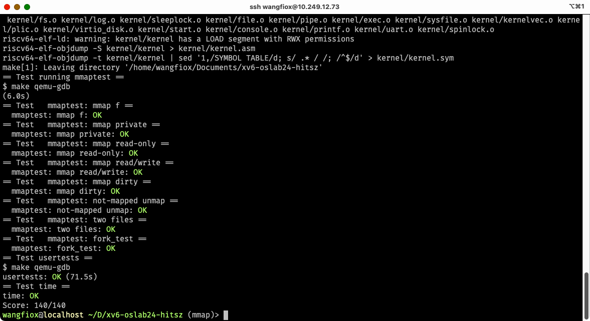

# fs

## Large files

### 内容分析

支持一个二级间接索引.

mit's xv6 实验指导书中有提示: bmap. bmap 的功能是: 将文件的逻辑块地址转换成物理块地址.
如果逻辑块对应的物理块不存在, 那么就会分配相应的物理块, 并挂在文件的 block 表中,
这个表也是类似于 pagetable(基数树). 如果一级简介索引的 dir 不存在, 那么就相应的创建.
因此: 二级间接索引的 dir 不存在, 也要相应的创建. 这里的逻辑块地址就是: 一个文件的第几个块.

但是仅完善 bmap 是不能通过测试的. 发现: itrunc 也有涉及到间接索引的代码, 这里我们也要改.
itrunc 就是用来清空一个文件的内容的, 释放一个文件所有的逻辑块.

### 设计方法

参考 bmap 和 itrunc 的一级间接索引的写法, 仿写二级间接索引

### 代码

```c
// kernel/fs.c
static uint bmap(struct inode *ip, uint bn) {
  if (bn < NDIRECT) {
    uint addr = ip->addrs[bn];
    if (addr == 0) {
      addr = balloc(ip->dev);
      if (addr == 0) return 0;
      ip->addrs[bn] = addr;
    }
    return addr;
  }
  bn -= NDIRECT;

  if (bn < NINDIRECT) {
    // Load indirect block, allocating if necessary.
    uint addr = ip->addrs[NDIRECT];
    if (addr == 0) {
      addr = balloc(ip->dev);
      if (addr == 0) return 0;
      ip->addrs[NDIRECT] = addr;
    }
    struct buf *bp = bread(ip->dev, addr);
    uint *a = (uint *)bp->data;
    if ((addr = a[bn]) == 0) {
      addr = balloc(ip->dev);
      if (addr) {
        a[bn] = addr;
        log_write(bp);
      }
    }
    brelse(bp);
    return addr;
  }
  bn -= NINDIRECT;

  if (bn < NININDIRECT) {
    // Load indirect block, allocating if necessary.
    uint addr = ip->addrs[NDIRECT + 1];
    if (addr == 0) {
      addr = balloc(ip->dev);
      if (addr == 0) return 0;
      ip->addrs[NDIRECT + 1] = addr;
    }
    struct buf *bp = bread(ip->dev, addr);
    uint *a = (uint *)bp->data;  // dir1

    addr = a[bn / NINDIRECT];
    if (!addr) {
      addr = balloc(ip->dev);
      if (!addr) return 0;
      a[bn / NINDIRECT] = addr;
      log_write(bp);
    }
    brelse(bp);

    bp = bread(ip->dev, addr);
    a = (uint *)bp->data;  // dir2

    addr = a[bn % NINDIRECT];
    if (!addr) {
      addr = balloc(ip->dev);
      if (addr) {
        a[bn % NINDIRECT] = addr;
        log_write(bp);
      }
    }
    brelse(bp);

    return addr;
  }

  panic("bmap: out of range");
}
```

```c
// kernel/fs.c
void itrunc(struct inode *ip) {
  for (int i = 0; i < NDIRECT; i++) {
    if (ip->addrs[i]) {
      bfree(ip->dev, ip->addrs[i]);
      ip->addrs[i] = 0;
    }
  }

  if (ip->addrs[NDIRECT]) {
    struct buf *bp = bread(ip->dev, ip->addrs[NDIRECT]);
    uint *a = (uint *)bp->data;
    for (int i = 0; i < NINDIRECT; i++) {
      if (a[i]) bfree(ip->dev, a[i]);
    }
    brelse(bp);
    bfree(ip->dev, ip->addrs[NDIRECT]);
    ip->addrs[NDIRECT] = 0;
  }

  if (ip->addrs[NDIRECT + 1]) {
    struct buf *bp = bread(ip->dev, ip->addrs[NDIRECT + 1]);
    uint *a = (uint *)bp->data;  // dir1
    for (int i = 0; i < NINDIRECT; i++) {
      if (a[i]) {
        struct buf *bp = bread(ip->dev, a[i]);
        uint *b = (uint *)bp->data;  // dir2
        for (int j = 0; j < NINDIRECT; j++) {
          if (b[j]) bfree(ip->dev, b[j]);
        }
        brelse(bp);
        bfree(ip->dev, a[i]);
      }
    }
    brelse(bp);
    bfree(ip->dev, ip->addrs[NDIRECT + 1]);
    ip->addrs[NDIRECT + 1] = 0;
  }

  ip->size = 0;
  iupdate(ip);
}
```

## Symbolic links

### 内容分析

mit's xv6 实验指导书中有提示: 添加一个系统调用 symlink.
相应的, 添加 T_SYMLINK 文件类型, O_NOFOLLOW 文件控制标志.
完善 symlink 系统调用;
完善 open 系统调用, 即: 打开软链接文件的时候, 打开的是软链接文件本身(open with O_NOFOLLOW), 还是软链接指向的文件.

### 代码实现

```c
// kernel/sysfile.c
uint64 sys_symlink(void) {
  char target[MAXPATH], path[MAXPATH];
  if (argstr(0, target, MAXPATH) < 0 || argstr(1, path, MAXPATH) < 0) return -1;
  return symlink(target, path);
}
```

下面这个 symlink 参照了 create 的实现. 注意管理失败情况下资源的释放(reroll).
注意管理: 事务的开启/关闭, 锁的获取与释放. 个人感觉比较麻烦的是: 什么时候 iunlockput, 什么时候 iunlock.
这涉及到一个 inode-cache 的结构. 如果不 iput, 那么就会导致资源泄露: inode-cache 耗尽; 如果提早 iput 了, 会导致数据不安全.

```c
// kernel/sysfile.c
static int symlink(const char *target, const char *path) {
  char name[DIRSIZ];

  begin_op();
  struct inode *dp = nameiparent(path, name);
  if (!dp) {
    end_op();
    // printf("%s:%d parent dir does not exist\n", __FILE__, __LINE__);
    return -1;
  }

  int n = strlen(target);

  ilock(dp);

  struct inode *ip = dirlookup(dp, name, 0);  // dirlookup 并不会
  if (ip) {
    iunlockput(dp);
    end_op();
    // printf("%s:%d file: %s has existed\n", path, __FILE__, __LINE__);
    return -1;
  }

  // create
  ip = ialloc(dp->dev, T_SYMLINK);
  if (!ip) {
    iunlockput(dp);
    end_op();
    // printf("%s:%d ialloc failed\n", __FILE__, __LINE__);
    return 0;
  }

  ilock(ip);  // ilock here, ip
  ip->major = 0;
  ip->minor = 0;
  ip->nlink = 1;
  iupdate(ip);

  if (dirlink(dp, name, ip->inum) < 0) {
    // something went wrong. de-allocate ip.
    ip->nlink = 0;  // roll back
    iupdate(ip);
    iunlockput(ip);
    iunlockput(dp);
    end_op();
    // printf("%s:%d failed to write default entry in dir parent\n", __FILE__, __LINE__);
    return 0;
  }

  iunlockput(dp);
  end_op();

  // write
  begin_op();
  int r = writei(ip, 0, (uint64)target, 0, n);
  if (r != n) {
    ip->nlink = 0;  // roll back
    iupdate(ip);
    iunlockput(ip);
    end_op();
    // printf("%s:%d writei failed\n", __FILE__, __LINE__);
    return -1;
  }
  iunlockput(ip);
  end_op();

  return 0;
}
```

递归的解引用软链接. mit's xv6 实验指导书中有提示, 可能会出现: 软链接循环引用的极端情况.
这会导致 os 进入死循环, 因此我们要设置一个 threshold,
如果软链接解引用的层数超过了这个 threshold, 就 return -1;

```c
uint64 sys_open(void) {
  char path[MAXPATH];

  int omode;
  argint(1, &omode);
  int n;
  if ((n = argstr(0, path, MAXPATH)) < 0) return -1;

  begin_op();

  // get the inode
  struct inode *ip;        // if-else 初始化了 ip
  if (omode & O_CREATE) {  // O_CREATE 只能创建 T_FILE
    ip = create(path, T_FILE, 0, 0);
    if (ip == 0) {
      end_op();
      return -1;
    }
  } else {
    ip = namei(path);
    if (!ip) {
      end_op();
      return -1;
    }
    ilock(ip);
  }

  if (ip->type == T_SYMLINK && !(omode & O_NOFOLLOW)) {
    char target[MAXPATH];

    int threshold = 0;
    while (ip->type == T_SYMLINK) {
      struct inode *cur = ip;
      int r = r = readi(ip, 0, (uint64)target, 0, MAXPATH);
      if (r < 0) {
        iunlockput(ip);
        end_op();
        // printf("%s:%d file: readi failed\n", __FILE__, __LINE__);
        return -1;
      }
      ip = namei(target);
      if (!ip) {
        iunlockput(cur);
        end_op();
        // printf("%s:%d namei failed\n", __FILE__, __LINE__);
        return -1;
      }
      if (threshold++ > 10) {
        iunlockput(cur);
        end_op();
        // printf("%s:%d recursive depth to threshold\n", __FILE__, __LINE__);
        return -1;
      }
      ilock(ip);        // 注意一下这个位置, 可能有死锁, 也可能有数据竞争
      iunlockput(cur);  // cur is not needed anymore, so put it
    }
  }

  // check the flags sanity
  if (ip->type == T_DIR && omode != O_RDONLY) {  // dir 只能是 O_RDONLY
    iunlockput(ip);
    end_op();
    return -1;
  }
  if (ip->type != T_SYMLINK && (omode & O_NOFOLLOW)) {  // 只有 symlink 可以 O_NOFOLLOW
    iunlockput(ip);
    end_op();
    return -1;
  }
  if (ip->type == T_DEVICE && (ip->major < 0 || ip->major >= NDEV)) {
    iunlockput(ip);
    end_op();
    return -1;
  }

  int fd;          // 为当前进程分配一个 fd
  struct file *f;  // 分配一个 handler (打开文件表)
  if ((f = filealloc()) == 0 || (fd = fdalloc(f)) < 0) {
    if (f) fileclose(f);
    iunlockput(ip);
    end_op();
    return -1;
  }

  if (ip->type == T_DEVICE) {
    f->type = FD_DEVICE;
    f->major = ip->major;
  } else {
    f->type = FD_INODE;
    f->off = 0;
  }
  f->ip = ip;
  f->readable = !(omode & O_WRONLY);
  f->writable = (omode & O_WRONLY) || (omode & O_RDWR);

  if ((omode & O_TRUNC) && ip->type == T_FILE) {  // 清空文件
    itrunc(ip);
  }

  iunlock(ip);  // 之所以不用 iunlockput, 是因为: 这个 inode 是被 file 结构体持有的, 不需要释放
  end_op();

  return fd;
}
```

## make grade


